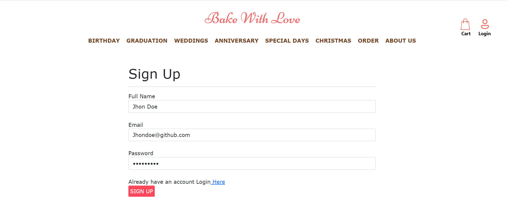
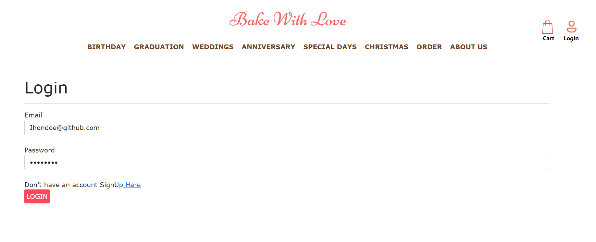
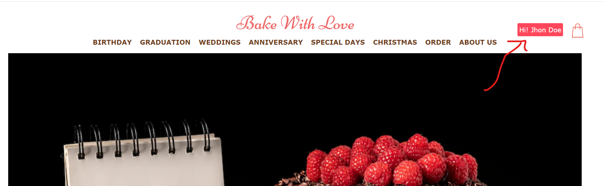
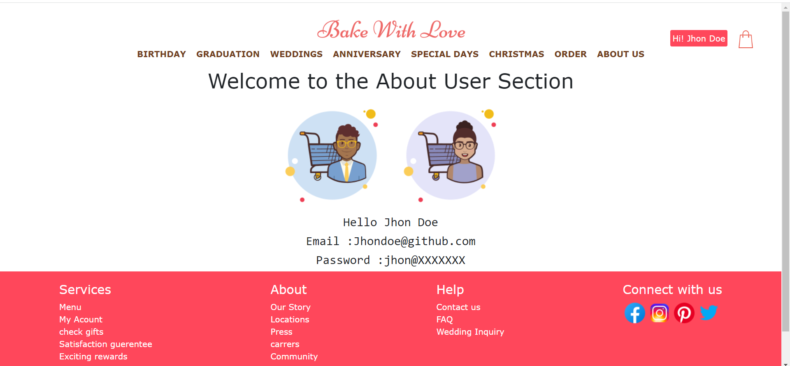
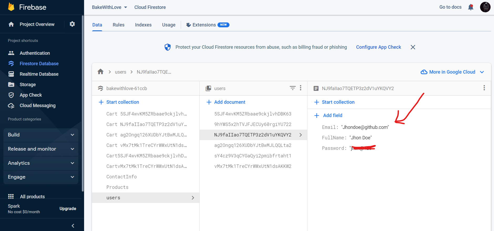
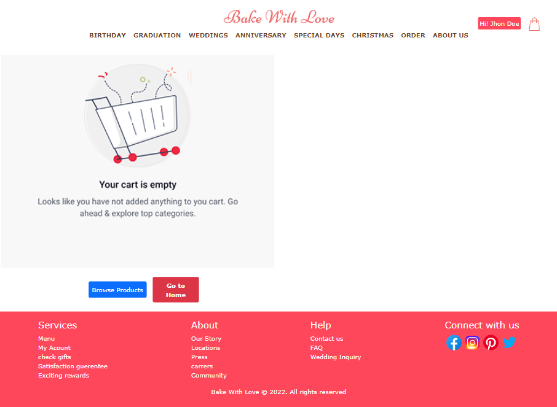
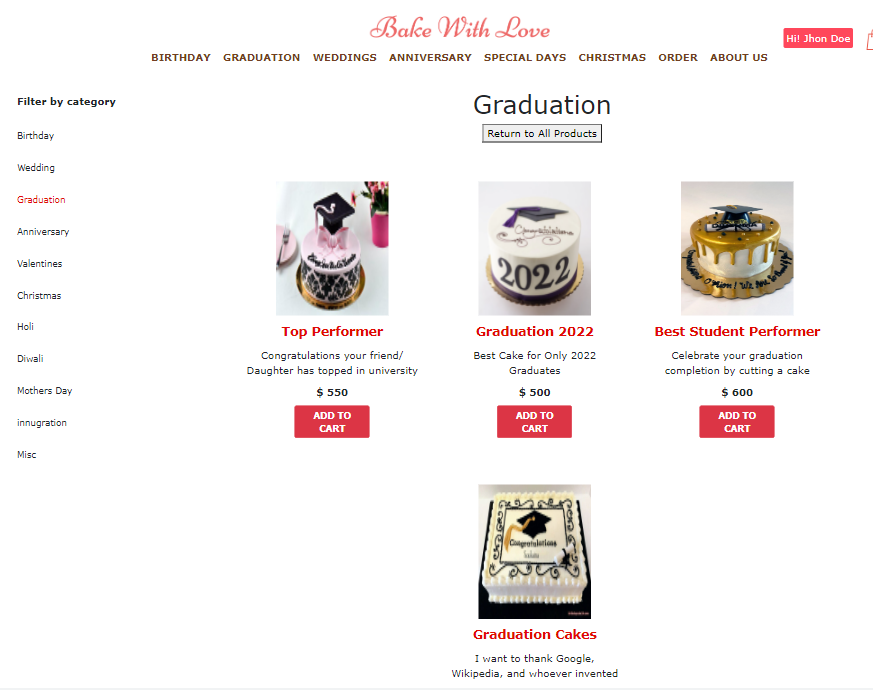
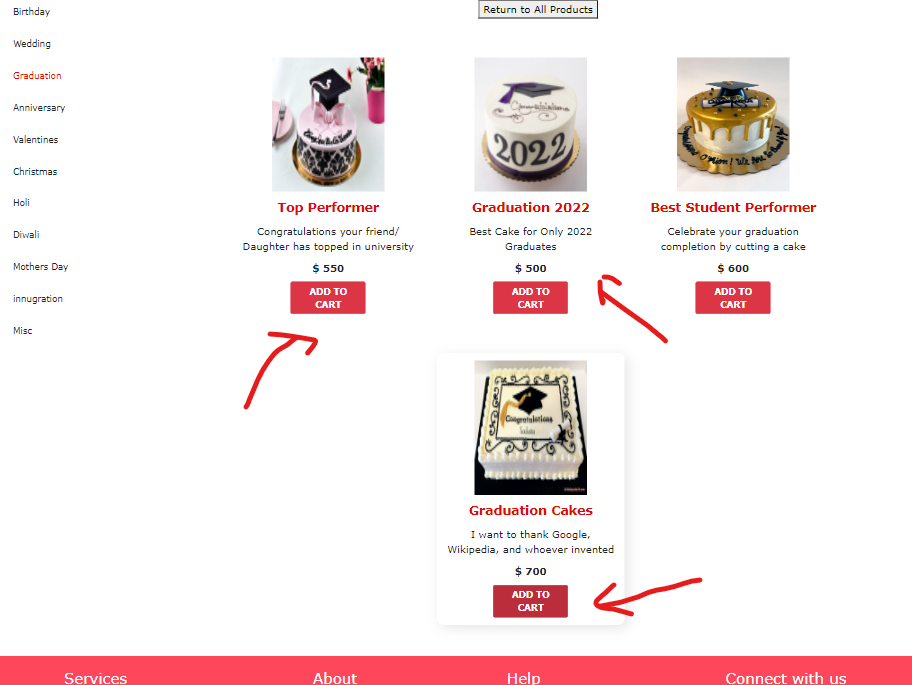
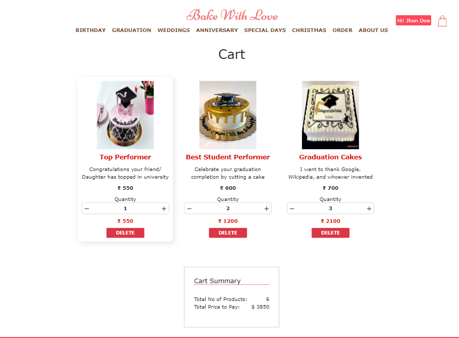
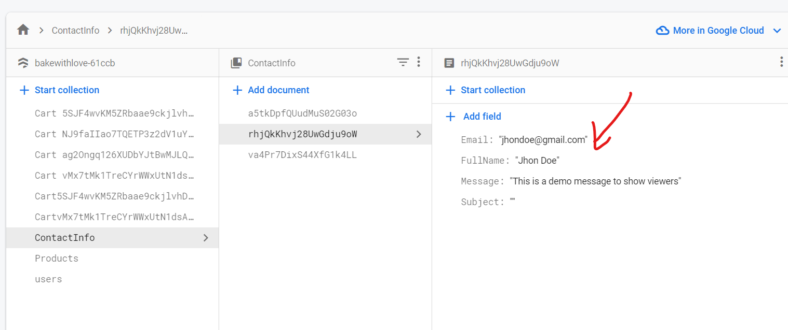

## Ecommerce Website | [Link](https://pursottam6003bakewithlove.netlify.app/)

Hello Everyone I am glad to introduce my new project  [**_Bake with love_**](https://pursottam6003bakewithlove.netlify.app/) which is developed by the help of **ReactJs** as **Frontend** and **Firebase** is used in **backend** for **server authentication** , **storing products**, **viewing cart** and **contact information of user**

**Bootstap ,HTML and CSS** are the building blocks of our site 

> I was constantly working in this project from last 1 months

Few features of My Ecommerce Website :
1. User can Sign in via their Email  and creating their customized passwords via server authentication of Firebase 

  
2. After Sign up it will redirect to  the log in page 

 

  
3. You will be navigated to the updated  home page
 

* check the about user section 

  
4. Every  users data is stored inside the firebase database 

  
5. Now you can even navigate to the home products section and view the product but before lets see your cart. 

  
6. Lets show some products and add to cart items
*  Step 1 

* step 2

* step 3

All the products are based on their category

  
7. Add the items into our cart

  

8. See our cart details and you can increase or decrease or delete

  
9. You can even contact the owner by filling the form 

  
10. Every thing is stored inside firebase 

Thank You for reading the README